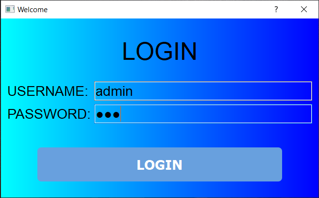
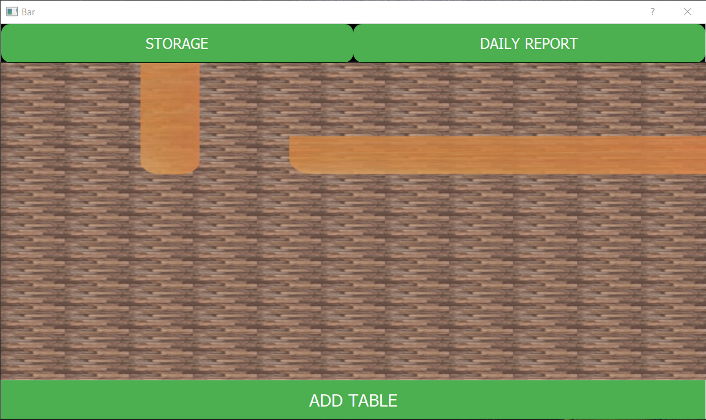
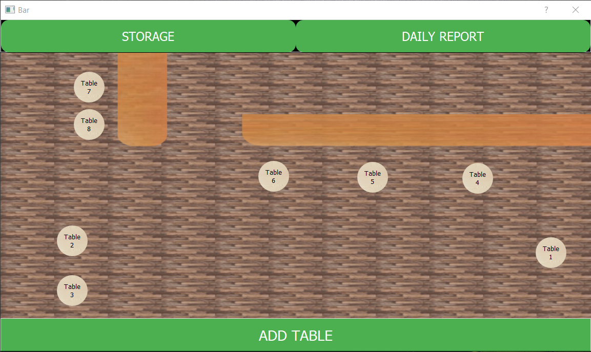
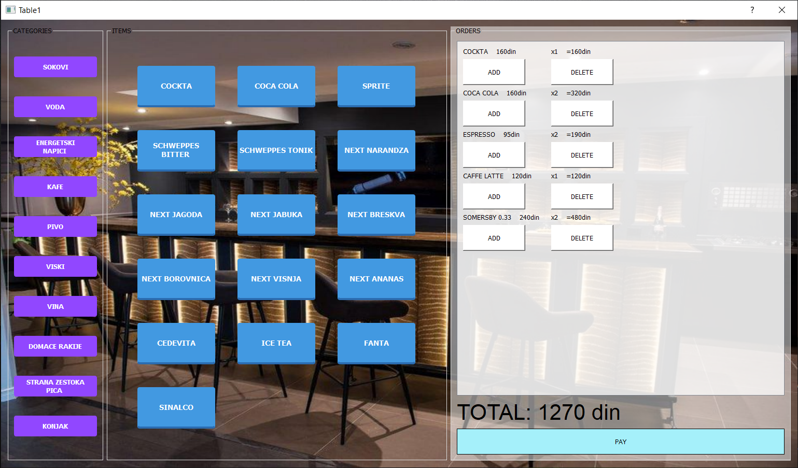
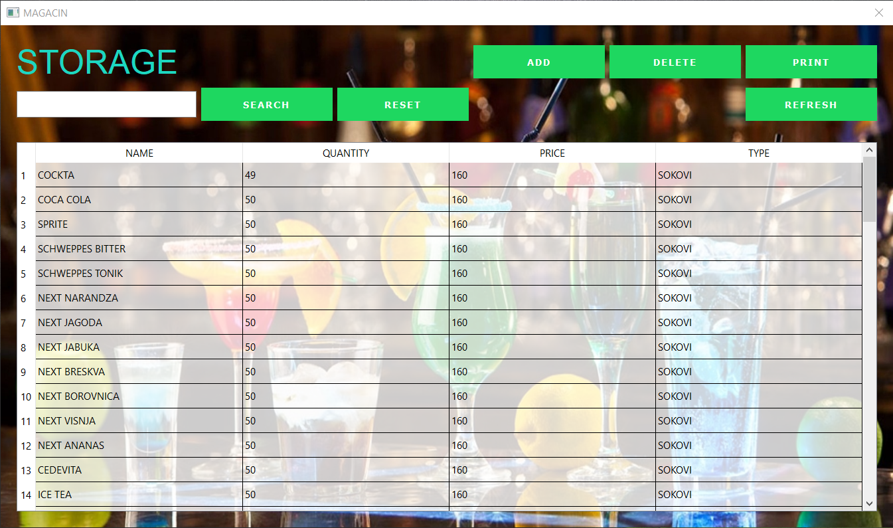
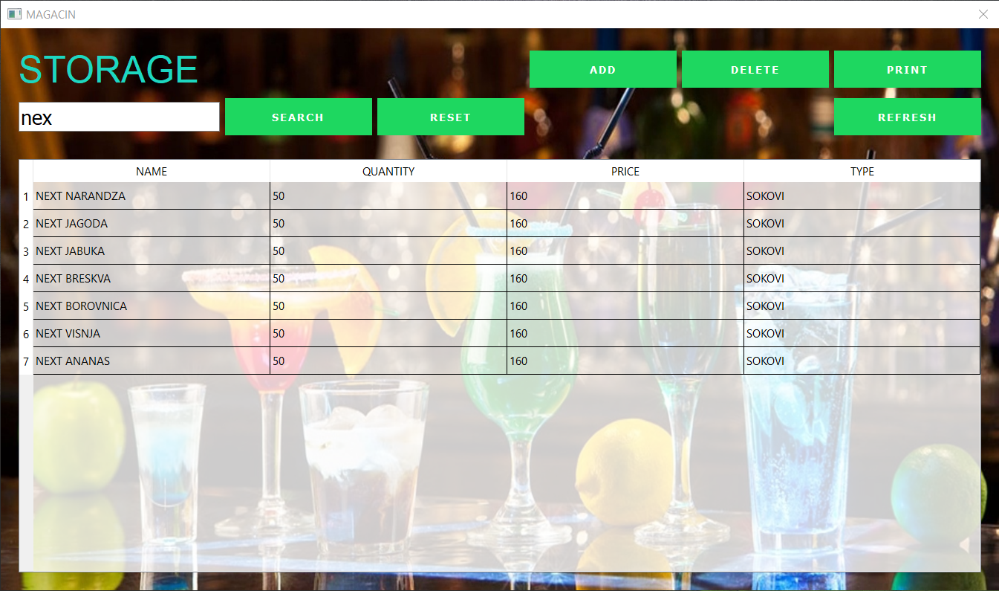

Username: admin

Password: kk3

This is application for desktop that is designed for cafes and bars.It has a purpose to help track orders and to manage storage.

First there is a login window that checks username and password with its internal database for a match.

After that you are taken to the main menu:

Here you can add tables with the button at the bottom and after they are added, click and hold right click on them to arrange them as you want.

After clicking on any table you are taken to its orders. Here you can chose from categories of drinks and add drinks to that tables order. Clicking on pay will remove all orders and add paid amount to the daily report.

At the main menu, clicking on a storage button you are presented with a list of items, all that are in storage. There is a search bar where you can filter items, add button which lets you add new item, delete button which after you have selected row from the table will delete it and print option so you can have it on paper.

